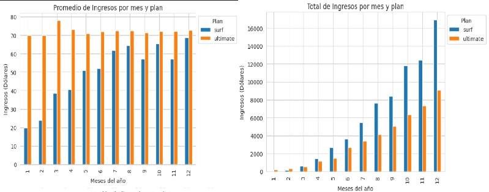
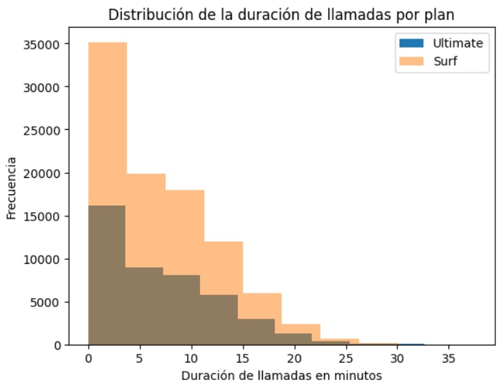
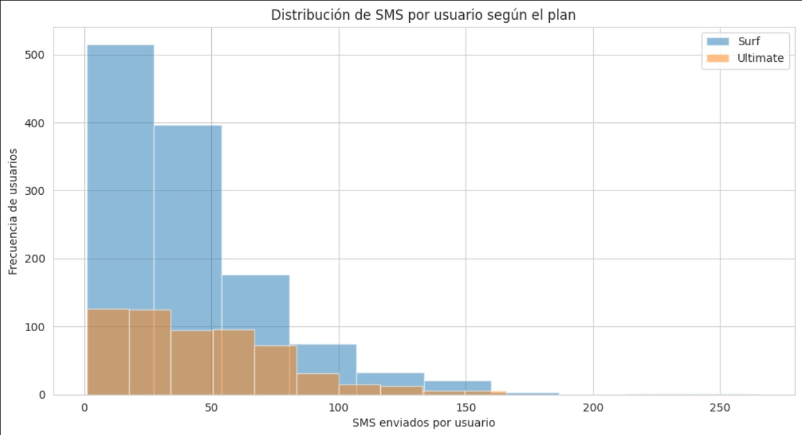
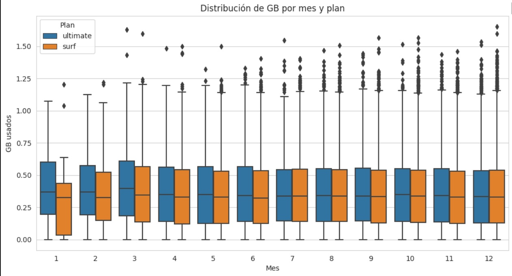

📊📞 ##Megaline – Análisis de Rentabilidad por Plan

🎯 Objetivo 
Determinar cuál de los planes de prepago (Surf vs Ultimate) genera mayores ingresos, con el fin de optimizar la estrategia comercial y el presupuesto de publicidad de la empresa.

📁 Dataset: 500 clientes – comportamiento durante 2018. Informacion dividida en diferentes datasets : megaline_plans.csv,megaline_calls.csv, megaline_internet.csv,megaline_messages.csv y megaline_users.csv

💻 Procesamiento de datos
Limpieza y validación de datos
Cálculo de consumo mensual (llamadas, SMS, datos)
Modelado de ingresos (tarifa fija + cargos por excedente)
Análisis exploratorio de datos (EDA)
Prueba t de hipótesis para validar diferencias de ingresos

🔎 Principales Hallazgos
💰 Ingresos
Ultimate genera mayor ingreso promedio mensual.
Presenta ingresos más estables (menor variabilidad).
Surf muestra alta variabilidad por cargos adicionales.
La diferencia de ingresos es estadísticamente significativa.

💬 SMS
Usuarios de Ultimate envían más mensajes en promedio.
Distribución sesgada a la derecha en ambos planes (Pocos usuarios envían muchos mensajes)

🌐 Datos
Consumo de GB muy similar entre planes.
No hay diferencia relevante en uso de datos.

🌎 Región
No existen diferencias significativas de ingresos por región (NY–NJ vs otras).

📌 Recomendaciones Estratégicas
Promocionar Ultimate como plan premium estable y rentable.
Incentivar migración de usuarios Surf con altos cargos extra.
Implementar campañas estacionales (fin de año).
No segmentar campañas por región (sin impacto significativo).

📈 Algunas Visualizaciones 

Promedio y Total de Ingresos por plan

Distribucion de llamadas

Distribucion de SMS

Data Usage Distribution 

